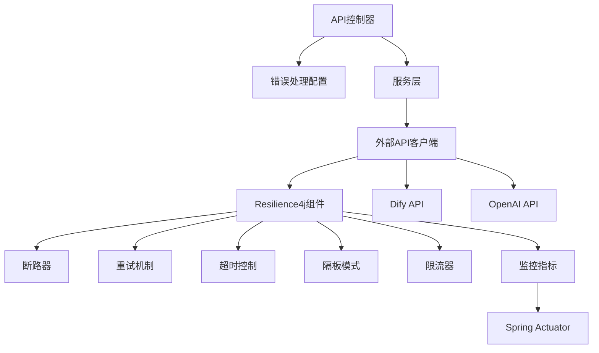
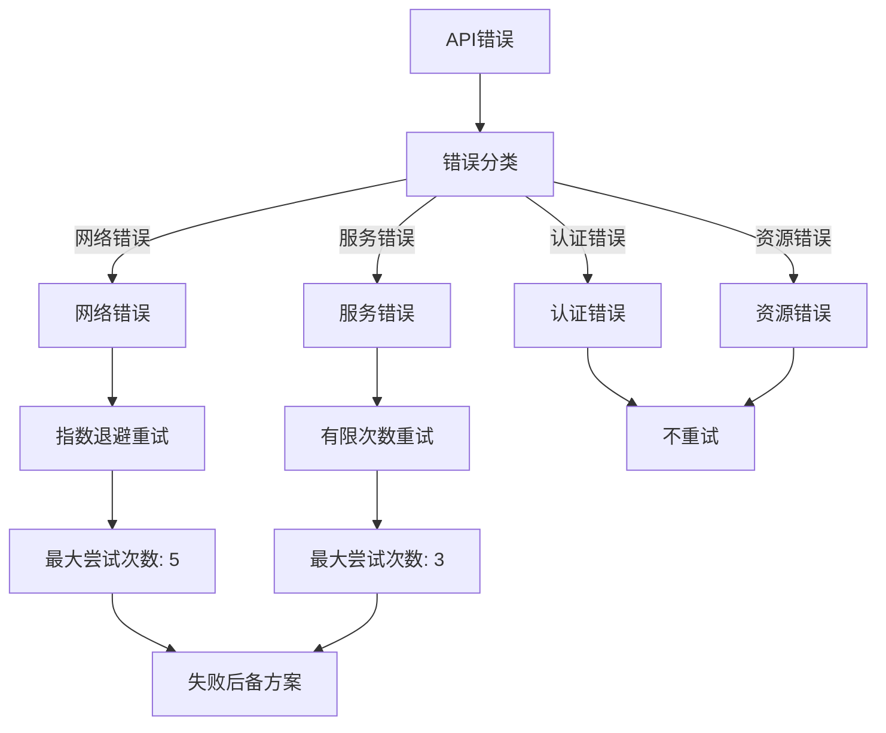
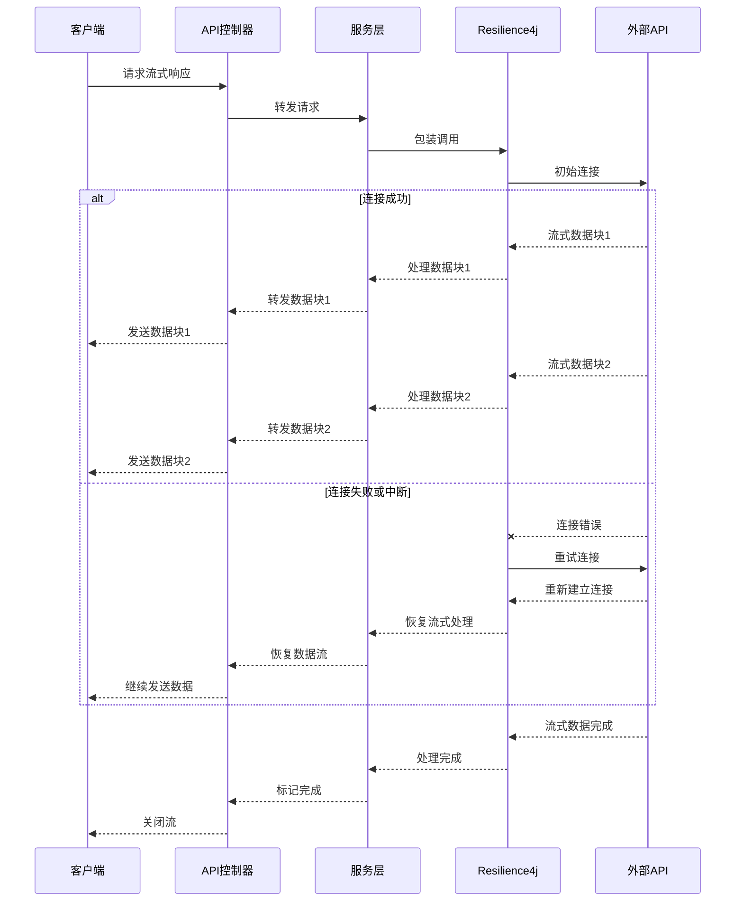

# 错误处理与重试机制架构设计

🎨🎨🎨 ENTERING CREATIVE PHASE: ARCHITECTURE DESIGN 🎨🎨🎨

## 问题陈述

EPAI平台当前在与Dify API和OpenAI API交互时缺乏健壮的错误处理和故障恢复机制。这导致在网络不稳定或外部服务暂时不可用时，应用性能下降并可能导致用户体验中断。特别是，流式响应处理中的错误可能导致数据不完整或连接断开，而没有适当的重试机制。

### 关键需求：

1. 提供统一的错误处理机制，适用于所有外部API调用
2. 实现智能重试策略，能够区分临时和永久性故障
3. 确保流式响应中的错误能被优雅处理，避免用户体验中断
4. 提供详细的错误日志和监控，便于问题诊断
5. 保持代码可维护性，避免错误处理逻辑分散在整个代码库中

## 架构选项分析

### 选项1：集中式错误处理服务

**描述**：创建一个专门的错误处理服务，所有外部API调用都通过此服务进行代理，统一处理错误和重试逻辑。

**优点**：
- 错误处理逻辑完全集中化，便于维护
- 可以为所有服务提供一致的错误处理策略
- 便于实现全局的监控和日志记录
- 可独立扩展和优化错误处理服务

**缺点**：
- 引入新的服务增加系统复杂性
- 可能成为性能瓶颈，特别是对于高频API调用
- 为流式响应添加额外网络层可能增加延迟
- 实现复杂度较高，需要考虑服务本身的高可用性

**技术契合度**：中
**复杂度**：高
**可扩展性**：高

### 选项2：AOP切面式错误处理

**描述**：使用Spring AOP实现横切关注点的错误处理，通过注解和切面拦截外部API调用并应用统一的错误处理逻辑。

**优点**：
- 与Spring生态系统无缝集成
- 不需要修改现有服务代码结构
- 错误处理逻辑集中在切面中，易于维护
- 可以根据不同服务定制不同的错误处理策略

**缺点**：
- 对流式处理和reactive编程模型的支持有限
- 可能导致"魔法代码"，降低代码可读性
- 某些复杂错误情况可能难以在切面中处理
- 需要仔细设计以避免切面间的相互干扰

**技术契合度**：高
**复杂度**：中
**可扩展性**：中

### 选项3：Resilience4j集成方案

**描述**：集成Resilience4j库，实现断路器、重试、限流、超时等弹性功能，并为各个外部服务调用包装这些弹性模式。

**优点**：
- 使用成熟的弹性编程库，不需要从零开始实现
- 提供丰富的弹性模式：断路器、重试、限流、超时等
- 支持声明式注解和编程式API
- 提供详细的指标监控和事件发布
- 与Spring Boot和Spring Cloud生态系统集成良好

**缺点**：
- 需要为每个外部服务调用添加额外的配置和代码
- 对于流式响应处理，需要特殊处理
- 需要团队学习新库的使用方法
- 配置不当可能导致意外的行为

**技术契合度**：高
**复杂度**：中
**可扩展性**：高

## 决策

**选择方案**：选项3 - Resilience4j集成方案

**理由**：
1. Resilience4j提供了成熟、全面的弹性编程功能，能够满足我们的所有错误处理和重试需求。
2. 它与Spring Boot和Spring Cloud生态系统集成良好，符合我们的技术栈。
3. 提供了声明式和编程式API，可以灵活应用于不同场景，包括流式响应处理。
4. 相比自建服务，使用Resilience4j降低了实现复杂度和维护成本。
5. 该方案提供了丰富的监控指标，便于问题诊断和系统优化。

🎨 CREATIVE CHECKPOINT: 架构方案选择完成

## 实现设计

### 组件结构



### 关键组件

1. **ResilienceConfiguration**: 集中配置断路器、重试、超时等Resilience4j组件。
2. **ResilienceAspect**: AOP切面，用于应用Resilience4j功能到外部服务调用。
3. **CustomExceptionHandler**: 全局异常处理器，统一处理和转换异常。
4. **MetricsCollector**: 收集和发布弹性操作相关的指标。
5. **ReactiveResilience**: 专门用于处理reactive和流式响应的弹性模式适配器。

### 重试策略设计



### 流式响应处理设计



## 实现指南

1. **添加依赖**:
   ```xml
   <dependency>
       <groupId>io.github.resilience4j</groupId>
       <artifactId>resilience4j-spring-boot2</artifactId>
       <version>1.7.0</version>
   </dependency>
   <dependency>
       <groupId>org.springframework.boot</groupId>
       <artifactId>spring-boot-starter-aop</artifactId>
   </dependency>
   <dependency>
       <groupId>org.springframework.boot</groupId>
       <artifactId>spring-boot-starter-actuator</artifactId>
   </dependency>
   ```

2. **配置Resilience4j**:
   ```yaml
   resilience4j:
     retry:
       instances:
         difyApiRetry:
           maxAttempts: 5
           waitDuration: 1s
           enableExponentialBackoff: true
           exponentialBackoffMultiplier: 2
           retryExceptions:
             - org.springframework.web.client.ResourceAccessException
             - java.net.SocketTimeoutException
         openAiApiRetry:
           maxAttempts: 3
           waitDuration: 2s
     circuitbreaker:
       instances:
         difyApiCircuitBreaker:
           slidingWindowSize: 10
           failureRateThreshold: 50
           waitDurationInOpenState: 10s
         openAiApiCircuitBreaker:
           slidingWindowSize: 10
           failureRateThreshold: 60
           waitDurationInOpenState: 20s
     bulkhead:
       instances:
         difyApiBulkhead:
           maxConcurrentCalls: 20
         openAiApiBulkhead:
           maxConcurrentCalls: 15
   ```

3. **为流式响应开发特殊处理机制**:
   ```java
   @Service
   public class ReactiveResilienceService {
       
       private final ReactiveCircuitBreaker circuitBreaker;
       private final ReactiveRetry retry;
       
       // 构造函数注入断路器和重试组件
       
       public Flux<String> executeWithResilience(Flux<String> streamingOperation) {
           return retry.executeFlux(
               circuitBreaker.executeFlux(streamingOperation)
                   .onErrorResume(this::handleStreamingError)
           );
       }
       
       private Flux<String> handleStreamingError(Throwable error) {
           // 错误处理和恢复逻辑
           if (isRecoverable(error)) {
               return Flux.empty().delayElements(Duration.ofMillis(500))
                   .mergeWith(Flux.just("[[恢复连接中...]]"));
           } else {
               return Flux.error(new StreamingException("流式处理错误", error));
           }
       }
   }
   ```

4. **创建统一的异常处理器**:
   ```java
   @ControllerAdvice
   public class GlobalExceptionHandler {
       
       @ExceptionHandler(CircuitBreakerOpenException.class)
       public ResponseEntity<ApiError> handleCircuitBreakerOpenException(CircuitBreakerOpenException ex) {
           ApiError error = new ApiError("SERVICE_UNAVAILABLE", "服务暂时不可用，请稍后再试", HttpStatus.SERVICE_UNAVAILABLE.value());
           return new ResponseEntity<>(error, HttpStatus.SERVICE_UNAVAILABLE);
       }
       
       @ExceptionHandler(BulkheadFullException.class)
       public ResponseEntity<ApiError> handleBulkheadFullException(BulkheadFullException ex) {
           ApiError error = new ApiError("TOO_MANY_REQUESTS", "系统繁忙，请稍后再试", HttpStatus.TOO_MANY_REQUESTS.value());
           return new ResponseEntity<>(error, HttpStatus.TOO_MANY_REQUESTS);
       }
       
       // 其他异常处理方法
   }
   ```

5. **服务层集成Resilience4j**:
   ```java
   @Service
   public class DifyChatServiceImpl implements DifyChatService {
       
       @Retry(name = "difyApiRetry")
       @CircuitBreaker(name = "difyApiCircuitBreaker")
       @Bulkhead(name = "difyApiBulkhead")
       @Override
       public Map<String, Object> sendChatMessageBlock(String query, Map<String, Object> inputs, 
                                                     String user, String conversationId, 
                                                     List<Map<String, Object>> files, 
                                                     Boolean autoGenerateName, String apiKey) {
           // 原有实现逻辑
       }
       
       // 流式响应处理需要特殊处理，不能直接使用注解
       @Override
       public void sendChatMessageStream(String query, Map<String, Object> inputs, 
                                       String user, String conversationId, 
                                       List<Map<String, Object>> files, Boolean autoGenerateName, 
                                       String apiKey, SseEmitter sseEmitter) {
           reactiveResilienceService.executeWithResilience(
               webClient.post()
                   .uri("/chat-messages")
                   .header(HttpHeaders.AUTHORIZATION, "Bearer " + apiKey)
                   // ... 其他设置
                   .retrieve()
                   .bodyToFlux(String.class)
           ).subscribe(
               dataLine -> {
                   try {
                       Map<String, Object> eventMap = objectMapper.readValue(dataLine, Map.class);
                       sseEmitter.send(SseEmitter.event().data(eventMap));
                   } catch (IOException e) {
                       // 处理错误
                   }
               },
               error -> {
                   // 处理错误，尝试恢复或优雅关闭
                   try {
                       sseEmitter.send(SseEmitter.event().data(Map.of("event", "error", 
                           "error", Map.of("message", "处理出错，正在尝试恢复..."))));
                   } catch (IOException e) {
                       // 记录无法发送错误信息
                   }
                   sseEmitter.completeWithError(error);
               },
               () -> sseEmitter.complete()
           );
       }
   }
   ```

## 验证和检查点

✓ **架构设计验证**
- [x] 所有系统需求已覆盖
- [x] 组件职责已明确定义
- [x] 接口已明确指定
- [x] 数据流已记录
- [x] 已解决安全考虑
- [x] 符合可扩展性需求
- [x] 符合性能需求
- [x] 已定义维护方法

✓ **实施准备就绪**
- [x] 已识别所有组件
- [x] 已映射依赖关系
- [x] 已记录技术限制
- [x] 已完成风险评估
- [x] 已定义资源需求
- [x] 已提供时间估计

🎨🎨🎨 EXITING CREATIVE PHASE - DECISION MADE 🎨🎨🎨 