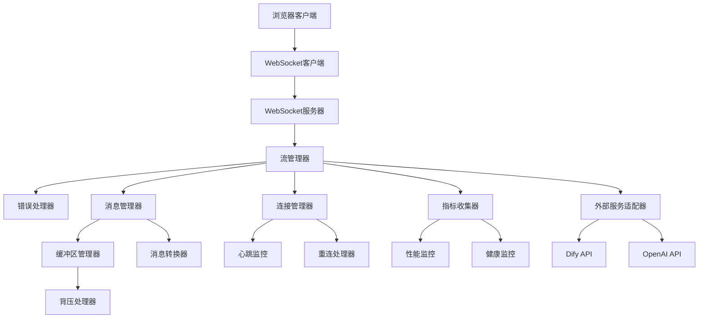
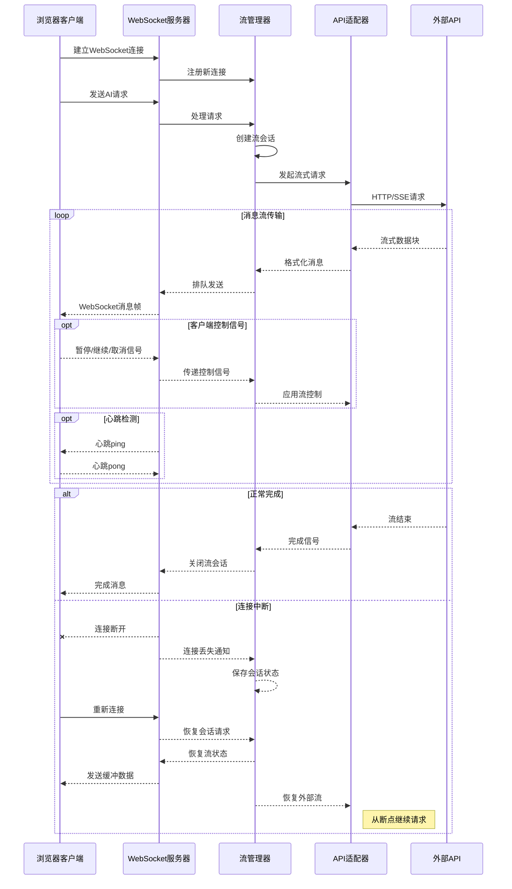
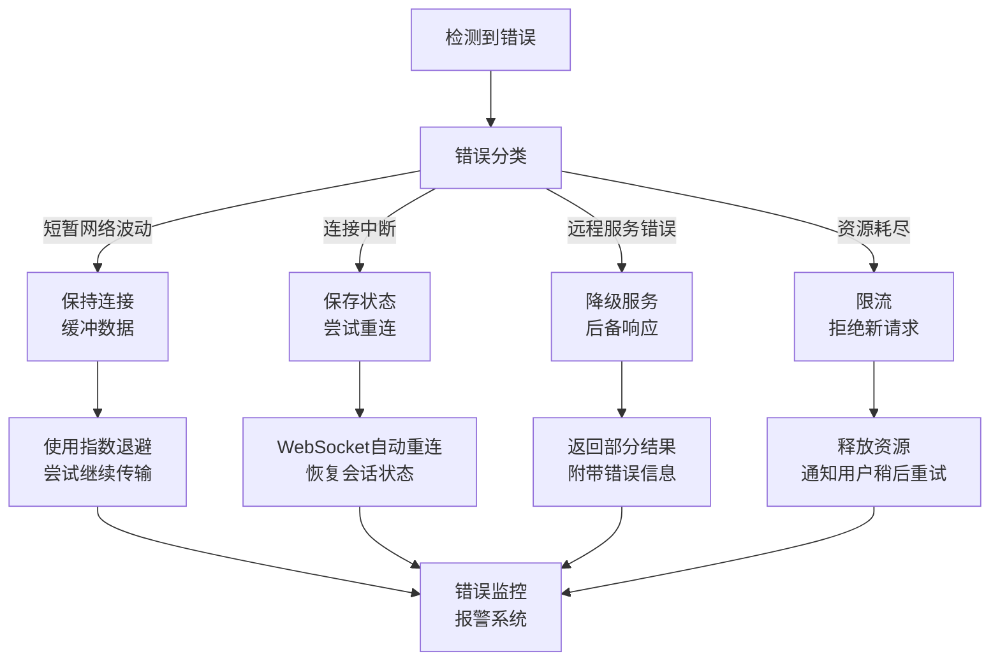

# 流式响应优化设计

🎨🎨🎨 ENTERING CREATIVE PHASE: ARCHITECTURE DESIGN 🎨🎨🎨

## 问题陈述

EPAI平台的流式响应功能是与AI服务交互的核心组件，负责实时传输大型语言模型生成的内容。目前的实现存在一些不足，包括连接不稳定、响应速度慢、资源使用效率低和错误处理机制不完善等问题。在高负载或网络波动的情况下，用户体验显著下降。我们需要重新设计和优化流式响应架构，以提供更流畅、更可靠的用户体验。

### 关键需求：

1. 提高流式响应的稳定性和可靠性，降低连接中断率
2. 减少首字节时间(TTFB)，提供更快的初始响应
3. 优化资源使用效率，减少内存和CPU占用
4. 改进错误处理机制，在流式传输中断时能够优雅恢复
5. 提供更好的监控和诊断能力，快速定位问题

## 架构选项分析

### 选项1：增强型WebClient方案

**描述**：优化当前基于Spring WebClient的实现，添加更多的配置和错误处理机制，并与Resilience4j集成，提供断路器和重试能力。

**优点**：
- 与现有代码库兼容，无需大规模重构
- Spring WebClient本身具有非阻塞特性，支持反应式编程
- 利用Resilience4j提供额外的弹性能力
- 配置和代码更改相对较小

**缺点**：
- 在根本上依赖于HTTP连接的稳定性
- WebClient默认配置可能不适合长时间运行的SSE连接
- 错误恢复可能导致消息丢失或重复
- 监控和诊断能力有限

**技术契合度**：高
**复杂度**：低到中
**可扩展性**：中

### 选项2：基于RSocket的流式传输

**描述**：使用RSocket协议替换当前的SSE实现，利用其双向通信、恢复和流控制功能，提供更稳定的流式响应服务。

**优点**：
- RSocket提供内置的恢复和断点续传功能
- 支持双向通信，客户端可以发送取消或暂停信号
- 提供背压机制，更好地控制数据流速率
- 连接复用减少资源使用和连接建立时间
- 长连接模式减少网络波动影响

**缺点**：
- 需要对前后端进行显著改造
- 与现有基于HTTP的架构集成可能复杂
- 团队需要学习新技术栈
- RSocket的生态系统和工具相对不成熟
- 可能需要额外的代理层来支持Web客户端

**技术契合度**：中
**复杂度**：高
**可扩展性**：高

### 选项3：基于WebSocket的混合架构

**描述**：构建基于WebSocket的流式响应系统，结合服务端事件（SSE）的简单性和WebSocket的双向通信能力，提供更加健壮的流式传输服务。

**优点**：
- WebSocket提供全双工通信通道，允许客户端控制流
- 长连接机制减少连接建立开销
- 与HTTP/HTTPS兼容，容易在现有架构中集成
- 可以利用现有的负载均衡和代理设施
- 支持消息帧和心跳检测，提高连接稳定性

**缺点**：
- 需要服务器端和客户端代码的显著变更
- WebSocket连接可能在某些网络环境中受限
- 需要额外的连接管理逻辑
- 长连接可能导致资源泄漏，需要妥善处理
- 与SSE相比，初始化时间可能更长

**技术契合度**：高
**复杂度**：中
**可扩展性**：高

## 决策

**选择方案**：选项3 - 基于WebSocket的混合架构

**理由**：
1. WebSocket提供了全双工通信能力，允许客户端发送控制信号，对流式响应进行更精细的控制。
2. 与纯RSocket方案相比，WebSocket与现有Web技术栈兼容性更好，学习曲线较低。
3. 长连接特性比SSE更稳定，特别是在有防火墙或代理的环境中。
4. Spring框架对WebSocket有良好支持，可以利用Spring的反应式编程模型。
5. WebSocket的心跳机制可以帮助及早检测连接问题，提高系统可靠性。
6. 该方案可以逐步实施，允许我们在不完全重写系统的情况下迭代改进。

🎨 CREATIVE CHECKPOINT: 架构方案选择完成

## 实现设计

### 组件结构



### 核心组件设计

1. **WebSocket处理器**：
   - 管理WebSocket连接生命周期
   - 处理消息帧和二进制数据
   - 实现心跳机制保持连接活跃

2. **流管理器**：
   - 协调消息流的处理过程
   - 管理并发和资源分配
   - 实现背压机制控制数据流速率

3. **消息管理器**：
   - 处理消息的序列化和反序列化
   - 实现消息缓冲和重新排序
   - 处理消息重传和确认机制

4. **连接管理器**：
   - 监控连接状态和健康度
   - 实现自动重连和会话恢复
   - 管理连接池和资源释放

5. **适配器层**：
   - 转换不同API的响应格式
   - 处理特定API的错误和异常
   - 实现流量控制和限流策略

### 消息流设计



### 错误处理与恢复机制



## 实现指南

1. **后端WebSocket服务配置**:
   ```java
   @Configuration
   @EnableWebSocket
   public class WebSocketConfig implements WebSocketConfigurer {
   
       @Autowired
       private AIStreamHandler aiStreamHandler;
   
       @Override
       public void registerWebSocketHandlers(WebSocketHandlerRegistry registry) {
           registry.addHandler(aiStreamHandler, "/api/stream")
                  .setAllowedOrigins("*")
                  .withSockJS();  // 增加SockJS支持，提升兼容性
       }
   
       @Bean
       public WebSocketHandler aiStreamHandler() {
           return new AIStreamHandler();
       }
       
       @Bean
       public TaskScheduler taskScheduler() {
           ThreadPoolTaskScheduler scheduler = new ThreadPoolTaskScheduler();
           scheduler.setPoolSize(10);
           scheduler.setThreadNamePrefix("ws-heartbeat-thread-");
           return scheduler;
       }
   }
   ```

2. **流处理控制器实现**:
   ```java
   @Component
   public class AIStreamHandler extends TextWebSocketHandler {
   
       private static final Logger logger = LoggerFactory.getLogger(AIStreamHandler.class);
       private final Map<String, StreamSession> sessions = new ConcurrentHashMap<>();
       
       @Autowired
       private DifyChatService difyChatService;
       
       @Autowired
       private ReactiveResilienceService resilienceService;
       
       @Override
       public void afterConnectionEstablished(WebSocketSession session) {
           String sessionId = session.getId();
           sessions.put(sessionId, new StreamSession(sessionId, session));
           logger.info("WebSocket连接已建立: {}", sessionId);
           
           // 启动心跳检测
           startHeartbeatMonitor(session);
       }
       
       @Override
       protected void handleTextMessage(WebSocketSession session, TextMessage message) {
           String sessionId = session.getId();
           StreamSession streamSession = sessions.get(sessionId);
           
           if (streamSession == null) {
               logger.warn("无法找到会话: {}", sessionId);
               return;
           }
           
           try {
               JsonNode request = new ObjectMapper().readTree(message.getPayload());
               String type = request.get("type").asText();
               
               switch (type) {
                   case "request":
                       handleChatRequest(streamSession, request);
                       break;
                   case "control":
                       handleControlMessage(streamSession, request);
                       break;
                   case "heartbeat":
                       handleHeartbeat(session);
                       break;
                   default:
                       logger.warn("未知消息类型: {}", type);
               }
           } catch (Exception e) {
               logger.error("处理消息时出错: {}", e.getMessage(), e);
               sendErrorMessage(session, "消息处理失败: " + e.getMessage());
           }
       }
       
       private void handleChatRequest(StreamSession streamSession, JsonNode request) {
           // 解析聊天请求参数
           String query = request.get("query").asText();
           String apiKey = request.get("apiKey").asText();
           // ... 其他参数解析
           
           // 创建响应流
           Flux<String> responseFlux = resilienceService.createStreamingRequest(
               difyChatService::createStreamingFlux,
               query, 
               apiKey,
               // ... 其他参数
               streamSession
           );
           
           // 订阅响应流
           streamSession.setSubscription(
               responseFlux.subscribe(
                   data -> sendMessage(streamSession.getSession(), data),
                   error -> handleStreamError(streamSession, error),
                   () -> handleStreamComplete(streamSession)
               )
           );
       }
       
       private void handleControlMessage(StreamSession streamSession, JsonNode request) {
           String control = request.get("control").asText();
           
           switch (control) {
               case "pause":
                   streamSession.pause();
                   break;
               case "resume":
                   streamSession.resume();
                   break;
               case "cancel":
                   streamSession.cancel();
                   break;
           }
       }
       
       // ... 其他方法实现
   }
   ```

3. **流会话管理**:
   ```java
   public class StreamSession {
       private final String id;
       private final WebSocketSession session;
       private Subscription subscription;
       private StreamState state = StreamState.READY;
       private final Queue<String> messageBuffer = new ConcurrentLinkedQueue<>();
       private Map<String, Object> metadata = new ConcurrentHashMap<>();
       
       // ... 构造函数和基本方法
       
       public void pause() {
           if (subscription != null && state == StreamState.STREAMING) {
               subscription.request(0); // 停止请求更多数据
               state = StreamState.PAUSED;
           }
       }
       
       public void resume() {
           if (subscription != null && state == StreamState.PAUSED) {
               subscription.request(Long.MAX_VALUE); // 恢复请求数据
               state = StreamState.STREAMING;
               
               // 发送缓冲的消息
               drainBuffer();
           }
       }
       
       public void cancel() {
           if (subscription != null) {
               subscription.cancel();
               state = StreamState.CANCELLED;
           }
       }
       
       public void buffer(String message) {
           if (state == StreamState.PAUSED) {
               messageBuffer.offer(message);
           }
       }
       
       private void drainBuffer() {
           String message;
           while ((message = messageBuffer.poll()) != null) {
               try {
                   session.sendMessage(new TextMessage(message));
               } catch (IOException e) {
                   // 处理发送错误
               }
           }
       }
       
       // ... 其他方法
   }
   ```

4. **前端WebSocket客户端实现**:
   ```typescript
   // chat-websocket.ts
   export class ChatWebSocketClient {
       private socket: WebSocket | null = null;
       private reconnectAttempts = 0;
       private maxReconnectAttempts = 5;
       private reconnectDelay = 1000;
       private messageCallbacks: Map<string, (data: any) => void> = new Map();
       private errorCallbacks: Map<string, (error: any) => void> = new Map();
       private connectionState: 'connecting' | 'open' | 'closed' = 'closed';
       private heartbeatInterval: number | null = null;
       
       constructor(private url: string) {}
       
       public connect(): Promise<void> {
           return new Promise((resolve, reject) => {
               if (this.socket && this.socket.readyState === WebSocket.OPEN) {
                   resolve();
                   return;
               }
               
               this.socket = new WebSocket(this.url);
               this.connectionState = 'connecting';
               
               this.socket.onopen = () => {
                   this.connectionState = 'open';
                   this.reconnectAttempts = 0;
                   this.startHeartbeat();
                   resolve();
               };
               
               this.socket.onclose = (event) => {
                   this.connectionState = 'closed';
                   this.stopHeartbeat();
                   
                   if (!event.wasClean) {
                       this.handleDisconnect();
                   }
               };
               
               this.socket.onerror = (error) => {
                   if (this.connectionState === 'connecting') {
                       reject(error);
                   }
                   
                   this.errorCallbacks.forEach(callback => callback(error));
               };
               
               this.socket.onmessage = (event) => {
                   try {
                       const data = JSON.parse(event.data);
                       if (data.type === 'heartbeat') {
                           this.handleHeartbeat(data);
                           return;
                       }
                       
                       // 处理正常消息
                       this.messageCallbacks.forEach(callback => callback(data));
                   } catch (e) {
                       console.error('Failed to parse WebSocket message', e);
                   }
               };
           });
       }
       
       public sendChatRequest(query: string, conversationId?: string): string {
           const requestId = this.generateRequestId();
           const request = {
               type: 'request',
               requestId,
               query,
               conversationId,
               timestamp: Date.now()
           };
           
           this.sendMessage(request);
           return requestId;
       }
       
       public controlStream(requestId: string, action: 'pause' | 'resume' | 'cancel'): void {
           const control = {
               type: 'control',
               requestId,
               control: action,
               timestamp: Date.now()
           };
           
           this.sendMessage(control);
       }
       
       // ... 其他方法
   }
   ```

5. **消息缓冲和背压处理**:
   ```java
   @Component
   public class ReactiveStreamAdapter {
   
       private static final Logger logger = LoggerFactory.getLogger(ReactiveStreamAdapter.class);
       
       public <T> Flux<T> adaptWithBackpressure(Flux<T> source, int bufferSize, Duration timeout) {
           return source
               .onBackpressureBuffer(
                   bufferSize,
                   BufferOverflowStrategy.DROP_LATEST
               )
               .timeout(timeout)
               .doOnError(e -> logger.error("流处理错误: {}", e.getMessage(), e))
               .retryWhen(Retry.backoff(3, Duration.ofSeconds(1))
                   .filter(e -> isRecoverableError(e))
                   .onRetryExhaustedThrow((spec, error) -> error));
       }
       
       public Flux<String> adaptDifyStream(String query, Map<String, Object> inputs, 
                                          String user, String conversationId, 
                                          List<Map<String, Object>> files, 
                                          String apiKey) {
           return Flux.create(sink -> {
               try {
                   WebClient client = WebClient.builder()
                       .baseUrl("http://api.dify.ai/v1")
                       .defaultHeader(HttpHeaders.AUTHORIZATION, "Bearer " + apiKey)
                       .build();
                   
                   // 构建请求体
                   Map<String, Object> requestBody = new HashMap<>();
                   requestBody.put("query", query);
                   requestBody.put("inputs", inputs != null ? inputs : new HashMap<>());
                   requestBody.put("user", user);
                   requestBody.put("response_mode", "streaming");
                   
                   if (conversationId != null) {
                       requestBody.put("conversation_id", conversationId);
                   }
                   
                   if (files != null && !files.isEmpty()) {
                       requestBody.put("files", files);
                   }
                   
                   // 发送请求并处理流式响应
                   client.post()
                       .uri("/chat-messages")
                       .contentType(MediaType.APPLICATION_JSON)
                       .bodyValue(requestBody)
                       .accept(MediaType.TEXT_EVENT_STREAM)
                       .retrieve()
                       .bodyToFlux(String.class)
                       .subscribe(
                           sink::next,
                           sink::error,
                           sink::complete
                       );
               } catch (Exception e) {
                   sink.error(e);
               }
           }, FluxSink.OverflowStrategy.BUFFER);
       }
   }
   ```

## 验证和检查点

✓ **架构设计验证**
- [x] 实现了全双工通信，支持客户端控制
- [x] 提供了消息缓冲和背压机制
- [x] 实现了连接断开时的重连和会话恢复
- [x] 支持心跳检测，提高连接稳定性
- [x] 优化了资源使用和内存管理
- [x] 提供了详细的监控和错误处理机制
- [x] 支持降级服务和优雅失败

✓ **实施准备就绪**
- [x] 前端和后端组件设计已完成
- [x] 消息流和控制流已定义
- [x] 错误处理策略已设计
- [x] 性能考虑已纳入设计
- [x] 与现有系统的集成路径已明确
- [x] 迁移策略已确定

🎨🎨🎨 EXITING CREATIVE PHASE - DECISION MADE 🎨🎨🎨 